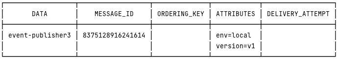

Redis Scheduler 를 이용해 타이머 태스크를 작동시키고, 해당 태스크로부터 GCP Pubsub 에 메시지를 발행한다.

## Controller 를 통해 Redis Scheduler 태스크 등록
```http request
POST http://localhost:8082/redis-timer/messages/register/timers/event-publisher3
```

## System Console Log
```shell
RegisterTimer#registerTimer >>>> 2023-06-13T12:15:44.476874
TimerTask#run >>>> 2023-06-13T12:15:47.661901
TimerTask#run.message >>>>event-publisher3
sendOrderExpireArrivalNoti
```

## Pubsub 에 게시된 메시지 결과
```shell
$ gcloud pubsub subscriptions pull carmerce-order-expire-arrival-noti-timer-local-v1 --auto-ack
```
